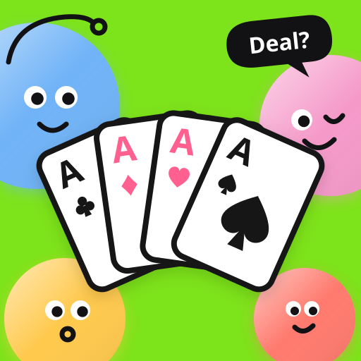

# CardGame3

An app for playing مداقش, the poker-style card game we play with friends. Everyone joins a room from their own phone, bets, makes deals with the boss, and reveals.

<p align="center"></p>

**Website:** [azzam-alrashed.github.io/CardGame3](https://azzam-alrashed.github.io/CardGame3/), a landing page served by GitHub Pages from [`docs/`](docs/).

## How the game works

- 4 to 13 players. The deck uses only the top ranks, one rank per player, and everyone gets 4 cards.
- Each player chooses to enter with a bet or sit the round out.
- The highest bettor becomes the **boss**. Other players can offer to withdraw in return for a share of his winnings.
- When the boss reveals, everyone without a deal reveals too, and the best hand wins. There is never a tie.

The full rules are in **[RULES.md](RULES.md)**.

## Features

- **Rooms with a 4-letter code.** Friends join from their own phones and see every move live.
- **AI players.** The host can fill empty seats with AI players (up to 13 seats), or play solo against 3 of them.
- **Step away anytime.** Leave a game in progress and a bot plays your seat until you tap **Back to game**.
- **The table never stalls.** Each betting turn has 45 seconds; when it runs out, a bot takes the seat until you take it back. The next round is dealt on its own.
- **Play again.** After a game, one tap opens a new lobby with the same AI players, and everyone else gets a **Join rematch** button.
- **A bot that plays fair.** It sees only its own cards, works out its odds by dealing imaginary hands from the cards it hasn't seen, and bluffs now and then.
- **Cards you can feel.** The dealer shuffles and deals around the table; your cards land face down and you tap to turn them over. Everyone sees how many cards each player has looked at, so you can bet without looking, or catch someone who did.
- **A real showdown.** Challengers turn their cards over one at a time, a darbuka drumroll, then the boss, card by card. The crown, the points and close calls ("Won on the suit! ♠ beats ♥") come last. Everyone's reveal plays to the end before the next round, and Skip jumps ahead on your phone.
- **Know your hand.** Your hand's name ("Pair of Queens") shows under your cards and next to every revealed hand.
- **Sound.** Chips, cards, little jingles and a darbuka drumroll. Quiet when the phone is on silent, with a speaker button to turn it off.
- **Safe names.** Offensive names are refused. Long-press any player to report their name or hide it on your phone.
- **First-launch onboarding** and a **How to play** sheet, also available at the table.
- **iPhone and iPad** in every orientation.

## Project layout

| Folder | What's inside |
| --- | --- |
| `firebase/functions/` | Backend in TypeScript: the rules engine and the bot (`src/engine/`), plus rooms, rounds and AI players as Cloud Functions |
| `firebase/firestore.rules` | Security rules: players see only their own room and their own cards |
| `ios/` | iOS app in SwiftUI (`CardGame3.xcodeproj`) |
| `assets/` | Logo and wordmark, and the script that builds the sound set (sounds by [Kenney](https://kenney.nl), CC0) |
| `docs/` | Landing page for GitHub Pages: one static `index.html` plus images in `docs/img/` |
| `android/` | Android app in Kotlin *(coming soon)* |

Tech choices are explained in **[TECH_STACK.md](TECH_STACK.md)**.

## Backend

| | |
| --- | --- |
| Firebase project | `cardgame-3` |
| Firestore | `me-central2` (Dammam) |
| Cloud Functions | `me-central1` (Doha). Dammam has no Cloud Functions. |
| Sign-in | Anonymous, plus a display name |

All game logic runs on the server. Phones only call functions and listen to their room, so nobody can peek at other players' cards.

Bots (AI players and away players) and timers also run on the server, in the background:

- Every change saves `wakeAt` on the room: when it next needs attention (a bot's move after a 2–4 second "thinking" pause, or the deals timer).
- A Cloud Task (`tickTask`) wakes the room at that time, does the one thing that is due, and schedules the next.
- A sweeper (`sweep`) runs every minute for rooms whose wake-up was missed, and `cleanup` deletes idle rooms once a day.

Moves return right away instead of waiting for bots. Firestore triggers can't be used because Cloud Functions isn't available in Dammam.

### Tests

You need Node.js. The emulator tests also need Java 21 (`brew install openjdk@21`).

```bash
cd firebase/functions
npm install
npm run test:emulator
```

`npm test` runs only the tests that don't need the emulators: the rules engine, the bot and the scheduling rules.

### Deploy

```bash
firebase deploy --only firestore:rules,functions
```

The first deploy with background bots needs the Functions service account to be allowed to schedule Cloud Tasks (once per project):

```bash
SA=$(gcloud projects describe cardgame-3 --format='value(projectNumber)')-compute@developer.gserviceaccount.com
gcloud projects add-iam-policy-binding cardgame-3 --member="serviceAccount:$SA" --role=roles/cloudtasks.enqueuer
gcloud projects add-iam-policy-binding cardgame-3 --member="serviceAccount:$SA" --role=roles/iam.serviceAccountUser
```

## iOS app

You need Xcode. Open `ios/CardGame3.xcodeproj`.

The Xcode project is committed and is the source of truth, including the signing team and other settings. Add new files through Xcode.

| Scheme | Backend |
| --- | --- |
| **CardGame3** | Live Firebase. Use this on real iPhones. |
| **CardGame3 (Emulators)** | Local emulators. Start them first with `firebase emulators:start --only auth,functions,firestore,tasks`. |

To install on your iPhone, select it as the device and set your **Team** under Signing & Capabilities.

## Status

- [x] House rules written down
- [x] Rules engine, with tests for every rule
- [x] Backend: rooms, rounds, deals, timer, security rules
- [x] Backend deployed to Firebase
- [x] iOS app: home, lobby, table, results, game over
- [x] iPhone and iPad, every orientation
- [x] Uploaded to App Store Connect
- [x] Onboarding and How to play
- [x] Leave mid-game, with a bot playing your seat
- [x] AI players added by the host
- [x] 0.1: bots and timers on the server, turn timer, rematch, reporting, hand names
- [ ] Share with friends through TestFlight
- [ ] Android app

## License

See [LICENSE](LICENSE).
